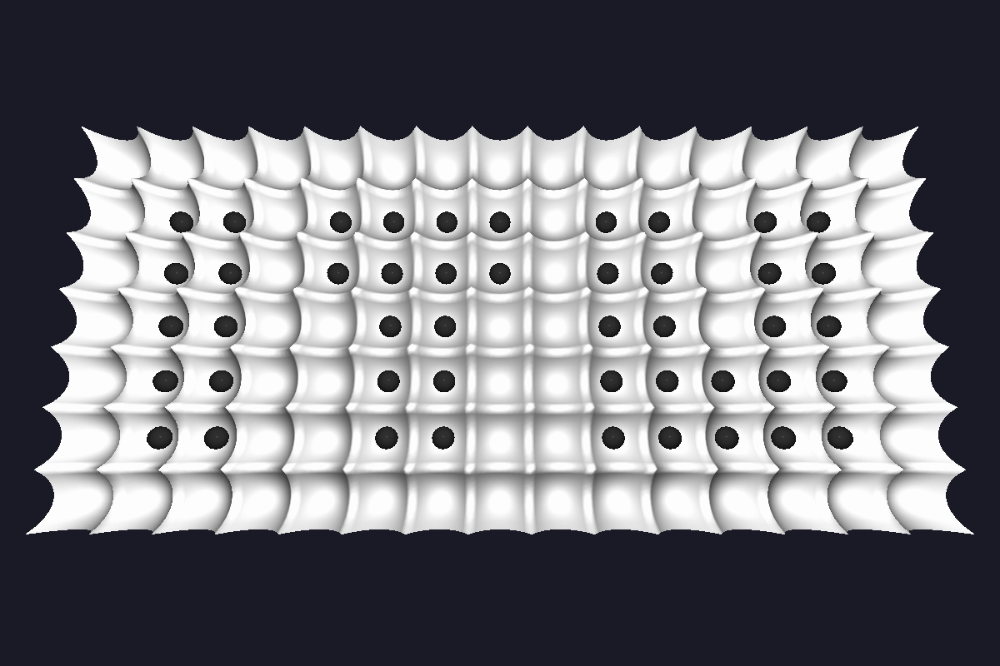

<h1>Manta Ray Surface Simulation</h1>

  A physics simulation of balls rolling on a deformable fabric surface suspended by a grid of
  controllable rods. Each rod can be raised or lowered by a controller, creating local slopes
  that guide ball movement across the surface.

  The fabric sag between rods is modelled with catenary curves, and ball dynamics
  (contact, collisions, friction, spin) are solved using XPBD
  (Extended Position Based Dynamics).

  Movement is directed by a <em>direction map</em> — a 2D grid of compass directions
  (N, S, E, W) that tells each rod which way to push nearby balls.
  Three controller strategies are available:
  <strong>blocking</strong> (waits for a free destination),
  <strong>non-blocking</strong> (pushes regardless), and
  <strong>priority</strong> (tries directions in order of preference).

<h2>Running</h2>

Run a simulation and save results to a data file:

<pre>
python run.py                                          # default experiment
python run.py --experiment experiments/itu_demo.py     # custom experiment
python run.py --no-save                                # run without saving data
</pre>

Visualize saved results:

<pre>
python visualize.py opengl       # interactive 3D viewer
python visualize.py video        # export MP4
python visualize.py matplotlib   # matplotlib animation
</pre>

<h2>Experiments</h2>

  Experiments are plain Python files in <code>experiments/</code>.
  Each file defines a <code>DIRECTION_MAP</code> and a controller name — the grid size
  is derived automatically from the map dimensions.

